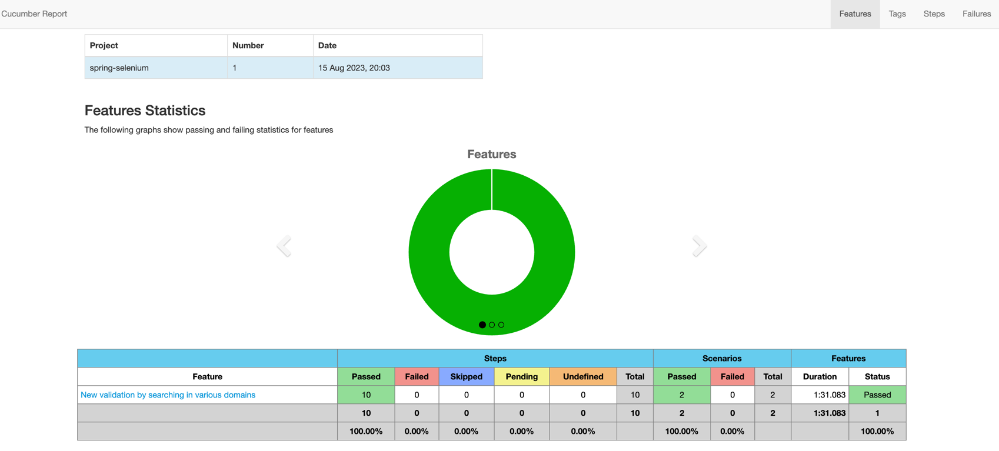
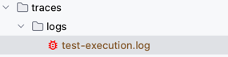

# UI - Test Automation

## About the framework

This framework has been build to cover the following scenarios in Goguardian news website

- Get all main news from Goguardian news application
- Check the validity of news in source like Google. For news that is searched, if we are getting more results in google then the news is genuine else new is not valid.
- Check the validity of news in source like Yahoo. For news that is searched, if we are getting more results in yahoo then the news is genuine else new is not valid.
- Stability, consistency and coverage of above tests in Chrome and Firefox browsers 


### Following are the set of tools and coding language used:

- [SpringBoot](https://spring.io/projects/spring-boot)
- [Cucumber](https://cucumber.io/)
- [TestNG](https://testng.org/doc/)
- [Maven](https://maven.apache.org/)
- [Java](https://www.java.com/en/)

## How to run the tests:

### Method 1: Open the terminal and execute the following command in project root directory:

To run the test on Chrome browser:

```agsl
mvn clean test
```
To run the test on Firefox browser:

```agsl
mvn clean test -Dbrowser=firefox
```

#### How to view the execution details:

Once execution is complete, cucumber report will be generated in the following location :

`target > Report > overview-features.html`




### Method 2: Running the tests using TestNG

Go to project root and open testng-suite.xml file. Right click and run the test as TestNG test

## Viewing execution logs:

Once test execution is complete, logs will be generated in root folder named **traces/logs** as shown below which is helpful for debugging and analysis of test failures.


